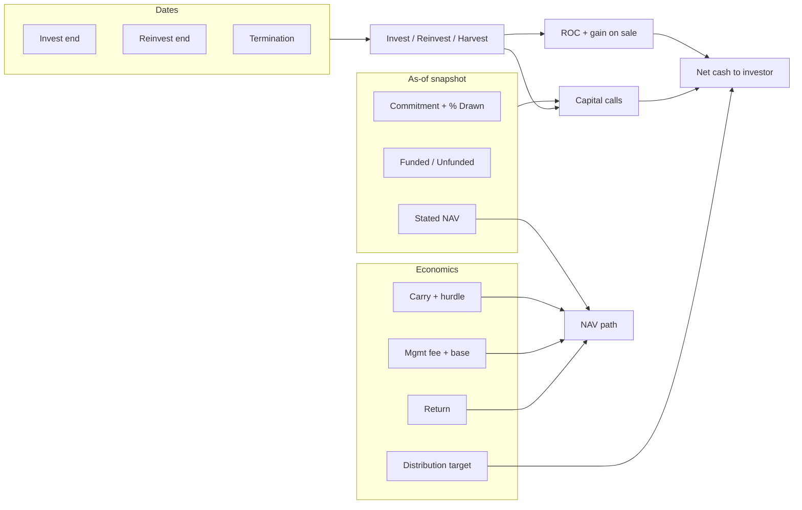

# Cash Flow Model Description

Plain-English reference for fund-level monthly cash flow line items and fund assumption inputs. This document describes how the illiquid alternative asset fund projection engine (`fund_engine.py`) calculates each output field and how assumptions from `inputs/FundAssumptions.xlsx` drive the model.

The approach follows the Takahashi–Alexander (Yale, 2001) style: commitments, drawdowns, distributions, and NAV over time.

---

## Part 1: Fund-Level Cash Flow Line Items (Each Period)

### Three kinds of months

Before the line items, every month falls into one of three buckets:

| Month type | What it is |
|------------|------------|
| **Period 0 (as-of)** | A snapshot on your valuation date. You plug in stated NAV and balances; most income/fee fields are blank. `net_cf` is set to **negative stated NAV** (a bookkeeping offset so the cash-flow series lines up with NAV). |
| **Operating months** | Normal projection months after the as-of date. All formulas below apply here. |
| **Liquidation month** | Only when the fund already terminated on or before the as-of date. One wind-down month: return whatever NAV is left via ROC and gain on sale, then zero everything out. |

Each operating month is also labeled **Invest**, **Reinvest**, or **Harvest** based on whether the month-end is before investment end, before reinvestment end, or after that.

---

### Commitment snapshot (status, not cash)

These four fields describe **how much commitment is left**, not cash moving yet.

#### Total commitment

The fund’s full commitment amount, but only while the fund is “active” (from the initial commitment month through termination). After termination, this drops to zero.

#### Effective commitment

Total commitment × “% of capital drawn.” This is the portion of the commitment the model actually treats as callable/in play.

#### Remaining effective unfunded

How much of the *effective* commitment is still not funded (invested).

- During the **investment phase**: `effective commitment − ending capital`, floored at zero.
- After investment ends: zero.

This number at the end of one month is what drives **how much gets called** next month.

#### Legal unfunded

Same idea, but against **total** commitment (not effective), and only **before reinvestment ends**. After reinvestment ends, zero.

---

### Capital account (money you put in and get back)

#### Beginning capital account

Last month’s **ending capital**. (Blank on period 0.)

#### Capital called

Cash **into** the fund (positive = you write a check).

Only during the **investment phase**, and only if there is still unfunded effective commitment. The model spreads whatever was unfunded at the start of the month **evenly** across the months from this month through the **investment end date**. No calls after investment ends, or if the fund was already fully funded at the start.

#### ROC (return of capital)

Cash **back** to you (negative in the output).

Only in **harvest** (after reinvestment ends): the model returns your invested capital (`beginning capital + any new calls this month`) on a **harvest schedule** — spread evenly month by month until termination, with **everything left returned in the termination month**.

On **immediate liquidation**, it returns capital up to funded amount (or all NAV if unfunded).

#### Ending capital

`Beginning capital + capital called + ROC`.

This is the **cost basis** still in the fund.

- Period 0: uses funded amount if still investing; otherwise the lesser of stated NAV and total commitment.
- Liquidation: forced to zero.

---

### Unrealized gain/loss and NAV (value on paper)

#### Beginning unrealized G/L

Opening paper profit/loss above cost.

- First operating month: `max(stated NAV − funded amount, 0)`.
- Later months: prior month’s ending unrealized G/L.

#### Asset income

Paper return on assets. Prior month’s NAV × monthly return (annual return converted to a monthly rate). Only while the fund has not passed termination; never negative (losses are not modeled here). Zero after termination.

#### Mgmt fee amount

Negative expense each month.

- If fees are **paid on committed** and you’re still in the investment phase: fee rate × **effective commitment** ÷ 12.
- Otherwise, if there is invested capital: fee rate × **prior ending capital** ÷ 12.

#### Pre-carry income

`Asset income + mgmt fee` (fee is already negative).

#### Carry amount

GP carried interest (negative when owed). The model annualizes pre-carry income (`pre-carry income ÷ prior ending capital × 12`). If that exceeds the **carry hurdle**, carry = negative pre-carry income × carry rate. Otherwise zero.

#### Dividend

Optional cash distribution to you (negative = cash out). Zero if distribution target is 0% or you’re at/past termination. Otherwise the target is prior NAV × (annual distribution target ÷ 12), but you cannot distribute more than **net income after carry** (asset income + fees + carry).

#### Retained income

What stays in the fund after carry and dividends: `pre-carry income + carry + dividend`. This is the month’s change in unrealized value before any realization.

#### Period G/L

Same as retained income — the month’s unrealized P&L before selling anything.

#### Gain on sale

Cash realization of unrealized gains (negative = paid out).

- If **termination falls in this month**: realize all remaining unrealized G/L (`−(beginning unrealized + period G/L)`).
- If unrealized is negative: zero.
- Otherwise: same **harvest schedule** as ROC, applied to positive unrealized G/L.
- Liquidation: realize `max(0, prior NAV − funded amount)`.

#### Ending unrealized G/L

`Beginning unrealized + period G/L + gain on sale`. Zero on period 0 and liquidation.

#### NAV

`Ending capital + ending unrealized G/L` — total fund value. Period 0 = stated NAV from assumptions; liquidation = 0.

---

### Net cash flow (what hits your bank account)

#### Net CF

Net cash **to the investor** (positive = money in).

For operating months and liquidation:

**Net CF = −(capital called + ROC + gain on sale + dividend)**

So:

- **Capital called** reduces net CF (you pay in).
- **ROC, gain on sale, and dividend** increase net CF when they are negative outflows from the fund (money back to you).

Fees and carry affect cash only **indirectly** — they reduce income, which caps dividends and flows into unrealized G/L; they are **not** a separate line in net CF.

Period 0: **net CF = −stated NAV** (snapshot offset).

---

### Harvest schedule (shared by ROC and gain on sale)

After **reinvestment ends**, the model does not return everything at once. It:

1. Divides the amount to return by the number of months from **this month** through **termination**.
2. Returns that slice each month.
3. In the **termination month**, returns **whatever is left** in one shot.

ROC uses the invested capital base; gain on sale uses the unrealized gain base.

---

### Lifecycle story (one sentence)

**Invest:** call capital evenly until investment end. **Reinvest:** stop calling; earn return, pay fees/carry, maybe pay dividends; NAV grows on paper. **Harvest:** return capital and realize gains on a schedule through termination. **NAV** always ties cost basis plus unrealized G/L; **net CF** is only the actual checks in and out (calls and distributions).

---

### Sign convention cheat sheet

| Line | Sign meaning |
|------|----------------|
| Capital called | **+** = you fund the fund |
| ROC, dividend, gain on sale, mgmt fee, carry | **−** = outflow from fund / expense |
| Asset income | **+** = paper gain |
| Net CF | **+** = net cash **to you** |

---

## Part 2: Fund Assumption Inputs and Their Effects

### How inputs enter the model

- Each **non-blank row** in `inputs/FundAssumptions.xlsx` becomes one fund in the engine.
- The **as-of date** (default **31 Dec 2025**) is **not** in the Excel file. It is set when you run the engine. That date is:
  - **Period 0** (valuation snapshot)
  - The start of the monthly projection
  - The date used to convert **GBP → USD** for portfolio totals
- **Initial commitment month** is set to the as-of date at load time (not a separate Excel column).
- Rows are validated on load (positive commitment, dates in order, rates between −100% and +100%, funded ≤ commitment, USD/GBP only, etc.).

### Excel column → engine field mapping

| Excel column | Engine field |
|--------------|--------------|
| Investment Name | `name` |
| Total Commitment | `commitment` |
| Stated Unfunded | `unfunded` (optional) |
| Funded Amount | `funded_amount` |
| Investment End Date | `invest_end_date` |
| Reinvestment End Date | `reinvest_end_date` |
| Termination Date | `termination_date` |
| Stated NAV | `stated_nav` |
| Ann. Asset Class Return (Conservative) | `annual_return` |
| Annual Fund Distribution Target | `dist_rate` |
| % of Capital Drawn | `pct_drawn` |
| Mgmt Fee | `mgmt_fee` |
| Paid on Committed? | `paid_on_committed` |
| Carry | `carry_rate` |
| Carry Hurdle | `carry_hurdle` |
| Currency | `currency` |
| Volatility | `volatility` |
| Asset Class | `asset_class` |
| Sub-Asset Class | `sub_asset_class` |
| Geography | `geography` |

---

### Identity

#### Investment Name

**What it is:** Fund label.

**Effect on cash flows:** None directly. Used in outputs and error messages. Blank rows are skipped.

---

### Snapshot at the as-of date (where you start)

These four fields pin down **period 0** and the opening balances that month 1 builds on.

#### Total Commitment

**What it is:** Legal commitment to the fund (in fund currency).

**Effect:**

- Sets **total commitment** and caps **legal unfunded** while reinvestment is still open.
- With **% of Capital Drawn**, defines **effective commitment** = commitment × % drawn.
- Caps some period-0 capital balances after investment ends.
- Drives whether the fund is still “active” through **termination date**.

**Bigger commitment →** higher commitment lines, more room for future calls (if still unfunded), and possibly higher fees if paid on commitment during invest.

#### Funded Amount

**What it is:** Capital already contributed as of the as-of date.

**Effect:**

- Period 0 **ending capital** while still in the invest phase.
- Seeds **remaining effective unfunded** = effective commitment − funded (unless overridden with Stated Unfunded).
- Seeds opening **unrealized G/L** = max(stated NAV − funded, 0) in month 1.
- If funded **already exceeds effective commitment**, the model **stops all future capital calls**.
- On **immediate liquidation**, splits payback between ROC (up to funded) and gain on sale (NAV above funded).

**Higher funded →** less left to call, lower unfunded, lower opening unrealized gain if NAV is unchanged.

#### Stated Unfunded *(optional)*

**What it is:** Remaining callable amount you believe is left (effective unfunded), if you want to override the calculation.

**Effect:**

- If **blank:** unfunded at start = max(0, effective commitment − funded amount).
- If **filled:** that number is used as starting **remaining effective unfunded** (still floored at zero).
- Feeds the **capital call** schedule: whatever is unfunded at the start of each invest-phase month is spread evenly through **investment end date**.

**Lower unfunded →** smaller future **capital_called**; **higher →** more calls still to come.

#### Stated NAV

**What it is:** Fund value at the as-of date.

**Effect:**

- Period 0 **NAV** and **net CF** (= −stated NAV).
- Opening unrealized gain in month 1 (NAV minus funded).
- If **≤ 0**, NAV is floored to 0 with a warning; very low NAV can trigger an **empty** one-row projection if the fund is already terminated.
- If **termination ≤ as-of** and NAV > 0, triggers a **one-month liquidation** right after period 0.

**Higher NAV →** higher asset income (return on prior NAV), higher dividend targets, larger harvest payoffs.

---

### Life-cycle dates (timing of everything)

All dates are normalized to **month-end**. They must be in order: **Investment End ≤ Reinvestment End ≤ Termination**.

They define the three **period_type** labels and when major behaviors turn on/off.

#### Investment End Date

**What it is:** Last month you can still **call** new capital.

**Effect:**

- While month-end ≤ this date → **Invest** phase; **capital_called** can be > 0.
- After this date → no more calls; **remaining effective unfunded** goes to 0.
- Management fee on **committed** capital (if selected) only applies through this date.

**Later invest end →** calls spread over more months (smaller monthly calls for the same unfunded); more time in invest phase.

#### Reinvestment End Date

**What it is:** Last month distributions can be **reinvested** in the fund (in the Yale/T-A sense); after this, you enter **harvest**.

**Effect:**

- While month-end ≤ this date → **Reinvest** phase (no ROC/harvest on the schedule yet).
- After this date → **Harvest**; **ROC** and **gain on sale** use the harvest schedule.
- **Legal unfunded** (vs total commitment) goes to 0 after this date.
- If reinvestment end is **before** the projection as-of date, **no capital calls** are modeled from the start.

**Earlier reinvest end →** harvest (return of capital and realization of gains) starts sooner.

#### Termination Date

**What it is:** Fund wind-down / last meaningful month.

**Effect:**

- Last month the fund is “active” for commitment purposes.
- **Asset income** stops after this date.
- **Dividends** stop at/after this date.
- In the termination month: **full remaining** ROC/gain on sale can be paid; unrealized G/L fully realized.
- Model expects **NAV → 0** by termination (validation checks this).

**Later termination →** longer harvest period (smaller monthly distributions, more months of income/fees before wind-down).

---

### Return and distributions (how NAV grows and pays out)

#### Ann. Asset Class Return (Conservative)

**What it is:** Annual return assumption (decimal, e.g. 0.08 = 8%).

**Effect:**

- Converted to a **monthly** rate: (1 + annual)^(1/12) − 1.
- Each month: **asset income** = prior NAV × monthly return (never negative).

**Higher return →** faster NAV growth, more pre-carry income, more room for dividends and carry, higher ending NAV before harvest.

#### Annual Fund Distribution Target

**What it is:** Target annual cash yield paid to investors (decimal).

**Effect:**

- Monthly target = prior NAV × (target ÷ 12).
- **Dividend** is the negative cash line (money out to you), capped by **net income after carry**.
- If **0**, no dividends.

**Higher target →** more cash out when income supports it; less retained in unrealized G/L.

---

### Fees and carry (drag on income)

#### Mgmt Fee

**What it is:** Annual management fee rate (decimal).

**Effect:**

- Monthly **mgmt fee amount** = negative fee ÷ 12.
- Base depends on **Paid on Committed?** (see below).

**Higher fee →** lower pre-carry income, smaller dividends, less NAV growth.

#### Paid on Committed?

**What it is:** TRUE/FALSE (or 1/0): fee base during invest phase.

**Effect:**

- **TRUE** and still in invest phase: fee on **effective commitment** (commitment × % drawn).
- **FALSE** (or after invest end): fee on **prior ending capital** (invested amount), if > 0.

**TRUE during a large commit, low funded →** fees can be high even before much capital is in the ground.

#### Carry

**What it is:** GP carried interest rate (decimal share of profits).

**Effect:**

- Each month, pre-carry income is annualized vs **prior ending capital**.
- If annualized return **exceeds carry hurdle**, **carry** = −pre-carry income × carry rate.
- Reduces net income available for dividends and retained G/L.

**Higher carry / lower hurdle →** more carry taken in strong months.

#### Carry Hurdle

**What it is:** Minimum annualized return (decimal) before carry applies.

**Effect:** Gate on carry only. Below hurdle → no carry that month.

---

### Structural assumption

#### % of Capital Drawn

**What it is:** Share of total commitment treated as economically “in play” (0–100%, as a decimal e.g. 0.85).

**Effect:**

- **Effective commitment** = total commitment × this %.
- Caps total calls over the life of the fund.
- Starting unfunded (unless overridden) uses **effective** commitment, not legal total.
- Interacts with funded amount: if funded > effective commitment, **no further calls**.

**Lower % →** smaller effective commitment, fewer/smaller calls, lower commitment-based fees.

---

### Reporting and portfolio (mostly not cash-flow math)

#### Currency

**What it is:** USD or GBP.

**Effect:**

- **Funds (Monthly)** and **Funds (Annual)** stay in **native currency**.
- **Portfolio** sheets convert to **USD** using spot FX from Yahoo Finance on the **as-of date**, then sum funds.
- Does not change the fund’s internal formulas — only how it rolls up to portfolio.

#### Volatility, Asset Class, Sub-Asset Class, Geography *(optional text)*

**What they are:** Labels for reporting and segmentation.

**Effect on cash flows:** **None.** They are copied to outputs and used to build **Portfolio (Annual)** breakdown rows (e.g. totals by asset class). The monthly projection math ignores them.

---

### How assumptions connect to cash flows

1. **Commitment, % drawn, funded, unfunded, NAV** set where you stand on day one and how much can still be called.
2. **Three dates** set when you call, when you harvest, and when the fund ends.
3. **Return, fees, carry, distribution target** set how NAV evolves and how much cash is paid out each month.
4. **Currency** affects portfolio USD aggregation; **metadata** affects portfolio tags only.

---

### Inputs that do not change monthly fund math

| Input / setting | Role |
|-----------------|------|
| Volatility, Asset Class, Sub-Asset Class, Geography | Portfolio reporting tags only |
| As-of date (in code, not Excel) | Period 0, projection start, FX date |
| Initial commitment month (set at load) | When total commitment is considered active |

---

### Practical “what if” reference

| If you change… | You mainly change… |
|----------------|---------------------|
| Total commitment or % drawn | Size of commitment lines and call capacity |
| Funded / stated unfunded | How much still gets called in invest phase |
| Stated NAV | Starting value, income base, liquidation behavior |
| Invest end | Length and pace of capital calls |
| Reinvest end | When harvest (ROC / realizations) begins |
| Termination | How long harvest runs and when NAV must go to zero |
| Annual return | NAV growth and income/fees/carry chain |
| Distribution target | Cash dividends when income allows |
| Mgmt fee / paid on committed | Expense drag and fee base |
| Carry / hurdle | GP take in strong months |
| Currency | Native fund outputs vs USD portfolio |

---

### Validation guardrails

On load, the engine rejects inconsistent rows (e.g. funded > commitment, dates out of order, rates outside (−100%, +100%), non-USD/GBP). After projection, it can flag funds whose **total calls exceed effective commitment**, **NAV is negative**, or **NAV is not ~0 at termination**.

---

## Related files

| Path | Purpose |
|------|---------|
| `fund_engine.py` | Core projection engine |
| `inputs/FundAssumptions.xlsx` | Fund assumption inputs (one row per fund) |
| `outputs/CashFlowOutputs.xlsx` | Generated monthly and annual outputs |
| `README.md` | Setup, run instructions, and technical field reference |
